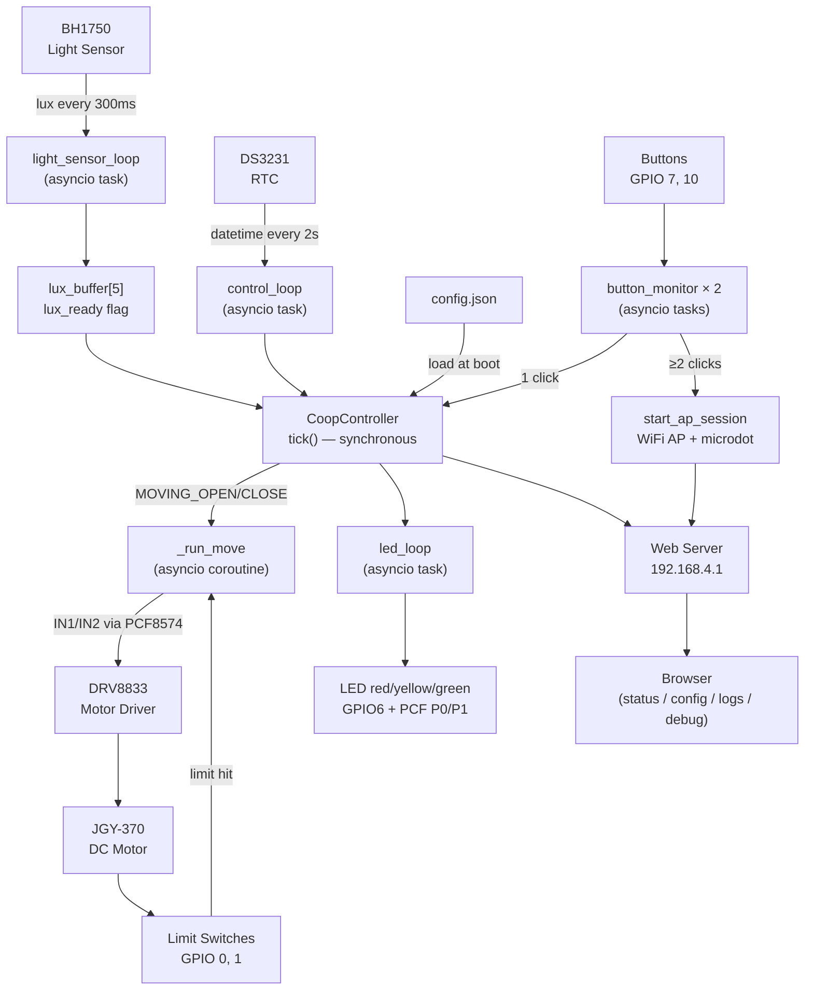

# 🐔 Smart Coop V2

**Automatic chicken coop door controller — ESP32-C3 · MicroPython · asyncio · Web UI**

[](https://www.python.org/)
[](https://micropython.org/)
[](https://www.espressif.com/en/products/socs/esp32-c3)
[](LICENSE)

---

Opens and closes a chicken coop door automatically based on ambient light and time-of-day windows. Built around an ESP32-C3, a self-braking DC motor, and a local-only WiFi access point for configuration — no cloud, no router dependency, no always-on WiFi.

---

## Features

- **Dual decision mechanism** — ambient light sensor (5-sample unanimity) + configurable time windows. Sensor is primary; time is a safety net.
- **Absolute backstop** — independently configurable hard open/close times for when the sensor alone isn't enough (lamp, full moon, sensor failure).
- **Manual override with state memory** — physical buttons or web UI. Manual state persists until the next backstop trigger.
- **Self-braking motor** — JGY-370 worm gear DC motor draws 0 mA at rest. No stall current, no heat, dramatically lower idle power vs the v1 servo.
- **Safety stop** — motor timeout (21 s) and DRV8833 nFAULT monitoring. Latched state, physical recovery required.
- **On-demand WiFi AP** — double-click either button to start the access point. Auto-shuts down after 10 minutes of inactivity.
- **Live web dashboard** — SSE-driven status, 30-day forecast SVG chart, config editor, event log.
- **Persistent binary log** — 365-record circular buffer on LittleFS (8 bytes/day). Zero pre-allocation.
- **Astronomical time windows** — sunrise/sunset approximation for Tarnów (~50°N, 21°E), ±15 min accuracy, pure cosine model.
- **DST-transparent RTC** — DS3231 always stores CET (UTC+1). Daylight saving is a logic layer concern only.
- **Fully testable on CPython** — dependency injection throughout. Complete pytest suite runs without hardware.

---

## Table of Contents

- [Hardware at a Glance](#hardware-at-a-glance)
- [Architecture](#architecture)
- [Getting Started](#getting-started)
  - [Local Development (CPython)](#local-development-cpython)
  - [Deploy to ESP32-C3](#deploy-to-esp32-c3)
- [Configuration](#configuration)
- [Web Interface](#web-interface)
- [LED Status Reference](#led-status-reference)
- [Documentation](#documentation)
- [Project History](#project-history)
- [License](#license)

---

## Hardware at a Glance

| Component | Part | Purpose |
|-----------|------|---------|
| MCU | ESP32-C3 Super Mini | WiFi, USB, 3.3 V logic |
| Motor driver | DRV8833 | 1.5 A peak, nSLEEP power gating |
| DC motor | JGY-370 (6 V, worm gear) | Self-braking — 0 mA holding current |
| GPIO expander | PCF8574 (I2C 0x20) | LEDs + motor IN1/IN2 |
| RTC | DS3231 (ZS-042) | TCXO ±2 ppm, CR2032 backup |
| Light sensor | BH1750 (GY-302) | Lux measurement, I2C 0x23 |
| Limit switches | 2× microswitch | Door-open / door-closed detection |
| Push buttons | 2× momentary | Manual open/close + WiFi AP trigger |

> Full pinout, wiring diagram and BOM: [docs/hardware.md](docs/hardware.md)

---

## Architecture



The system runs entirely in a single `uasyncio` event loop. `tick()` is a plain synchronous function — no I/O, no await — which makes the state machine trivially testable with mock objects on any Python 3.13+ environment.

---

## Getting Started

### Local Development (CPython)

Requires Python 3.13+ and [`uv`](https://github.com/astral-sh/uv).

```bash
# Clone and install
git clone https://github.com/albertlis/Automatic-door-opening-system.git
cd Automatic-door-opening-system
uv sync --extra dev

# Run the full test suite
uv run pytest tests/ -v

# Lint and format
uv run ruff check src/ tests/
uv run ruff format src/ tests/

# Start the web UI locally (no hardware needed)
python run_local.py
# → open http://localhost:5000
```

The local server uses mock hardware objects. All web pages, the SVG forecast chart, config editor, and log viewer work without an ESP32.

#### Test Structure

| Suite | What it covers |
|-------|---------------|
| `tests/test_astro.py` | Sunrise/sunset approximation, DST boundary detection |
| `tests/test_config.py` | Config load/save, validation invariant, helper functions |
| `tests/test_state.py` | All state machine transitions, safety stop, I2C error handling |
| `tests/test_async.py` | `_run_move`, `light_sensor_loop`, `control_loop`, `button_monitor` |
| `tests/test_api.py` | All REST endpoints, time sync, config POST validation |
| `tests/test_logs.py` | Binary log write/read, circular buffer wrap, sentinel values |

**TDD protocol:** write the test suite first (all fail), then implement until all pass.

---

### Deploy to ESP32-C3

#### 1. Flash MicroPython

Download the latest `ESP32_GENERIC_C3` firmware from [micropython.org/download](https://micropython.org/download/ESP32_GENERIC_C3/).

```bash
esptool --chip esp32c3 --port COM<N> erase_flash
esptool --chip esp32c3 --port COM<N> --baud 460800 write_flash -z 0x0 ESP32_GENERIC_C3-*.bin
```

#### 2. DS3231 Modification

> ⚠️ **Do this before installing the CR2032 battery.**
>
> The ZS-042 board has a charging circuit for rechargeable cells. CR2032 is non-rechargeable.  
> **Desolder the power LED and the charging resistor** before fitting the battery.  
> See [docs/hardware.md](docs/hardware.md#ds3231-zs-042--required-modification) for details.

#### 3. Upload Files

Upload order matters — `main.py` triggers boot on upload, so it must go last.

```bash
mpremote connect COM<N> fs mkdir /www

mpremote connect COM<N> fs cp src/compat.py   :compat.py
mpremote connect COM<N> fs cp src/astro.py    :astro.py
mpremote connect COM<N> fs cp src/config.py   :config.py
mpremote connect COM<N> fs cp config.default.json :config.json
mpremote connect COM<N> fs cp src/logs.py     :logs.py
mpremote connect COM<N> fs cp src/state.py    :state.py
mpremote connect COM<N> fs cp src/hardware.py :hardware.py
mpremote connect COM<N> fs cp src/web.py      :web.py
mpremote connect COM<N> fs cp src/www/index.html  :/www/index.html
mpremote connect COM<N> fs cp src/www/config.html :/www/config.html
mpremote connect COM<N> fs cp src/www/logs.html   :/www/logs.html
mpremote connect COM<N> fs cp src/www/debug.html  :/www/debug.html
mpremote connect COM<N> fs cp src/boot.py     :boot.py
mpremote connect COM<N> fs cp src/main.py     :main.py
```

#### 4. First Boot

1. Power on. `boot.py` detects the DS3231 default date (`2000-01-01`) and starts the WiFi AP automatically.
2. Connect to `Coop_Control` (password: `coop123`).
3. Open `http://192.168.4.1` → click **Synchronizuj czas z przeglądarki** to set the RTC.
4. Automatic open/close logic activates immediately once the year is ≥ 2020.
5. On subsequent boots, WiFi is OFF by default. Double-click either button to start the AP.

---

## Configuration

Three independently configurable sections — each has its own `mode`:

| Section | Controls | Modes |
|---------|----------|-------|
| `window` | When is the light sensor active? | `sun_position` (dynamic) · `legacy` (fixed hours) |
| `override_open` | Backstop: latest allowed open time | `dynamic` (N min after sunrise) · `fixed` (clock hour) |
| `override_close` | Backstop: latest allowed close time | `fixed` (clock hour) · `dynamic` (N min after sunset) |

Additional parameters:

| Parameter | Default | Description |
|-----------|---------|-------------|
| `light.lux_open` | 8.0 lx | Open threshold — all 5 samples must exceed this |
| `light.lux_close` | 3.0 lx | Close threshold — all 5 samples must be below this |
| `safety.move_timeout_s` | 21 s | Motor movement timeout before safety stop |

### Config Invariant

```
window_open  ≤  abs_open  <  abs_close  ≥  window_close
```

The backstop values must be **outside** the sensor window — they are the last-resort boundary, not the first trigger. Violating this invariant returns a 400 error on the config page with a specific message.

> Full configuration reference and seasonal behaviour: [State Machine & Control Logic](docs/state-machine.md#configuration-modes)

---

## Web Interface

Activated by double-clicking either physical button. Auto-shuts off after 10 minutes of idle.

| URL | Page | Description |
|-----|------|-------------|
| `/` | **Status** | Live gate state badge, lux readings, RTC time, today's schedule, 30-day forecast SVG, manual open/close buttons |
| `/config` | **Configuration** | All config parameters with mode toggles, browser time sync button |
| `/logs` | **Event Log** | Daily records: first open, last close, manual interventions, safety stop incidents |
| `/debug` | **Debug** | Raw sensor values, firmware version, WebREPL link, reboot button |

The status page uses **Server-Sent Events** (HTMX SSE extension) for live updates — no page refresh needed. Falls back to 2-second polling if SSE is unavailable.

The 30-day forecast SVG is generated server-side from the astronomical model — shows how the sensor window and backstop times shift with sunrise/sunset over the coming month.

---

## LED Status Reference

| State | LED | Pattern | Meaning |
|-------|-----|---------|---------|
| `IDLE_OPEN` · `MANUAL_HOLD_OPEN` | Green | Solid | Door fully open |
| `IDLE_CLOSED` · `MANUAL_HOLD_CLOSED` | Red | Solid | Door fully closed |
| `MOVING_OPEN` · `MOVING_CLOSE` | Green | 1 Hz blink | Door in motion |
| `SAFETY_STOP` | Red | 1 Hz blink | Motor stopped — physical button to recover |
| `ERROR` | Red | **4 Hz blink** | I2C failure or hardware fault — reboot required |
| Low RTC battery (any state) | Yellow | 1 Hz blink | CR2032 below 2.7 V — replace battery |

`ERROR` is distinguishable from `SAFETY_STOP` by blink speed. `LED_RED` (GPIO6) is wired directly to the MCU — it works even if the I2C bus and PCF8574 are dead.

---

## Documentation

| Document | Description |
|----------|-------------|
| [docs/hardware.md](docs/hardware.md) | Complete BOM, power topology, pin tables, PCF8574 wiring, DS3231 modification, DRV8833 notes |
| [docs/state-machine.md](docs/state-machine.md) | State diagram (Mermaid), full transition table, decision logic, time system, DST handling |
| [docs/api.md](docs/api.md) | Complete REST API reference with request/response examples for all 9 endpoints |
| [migraton.md](docs/migraton.md) | Full architecture specification and design decisions for V2 |

---

## Project History

**V1** (ATmega328P / Arduino / C++) — still in the `src/` history. Replaced due to:
- DS1307 RTC drift required nightly correction hack
- MG995 servo drew 400–600 mA stall current 24/7 to hold the door
- No USB, no remote visibility, no OTA updates

**V2** (this codebase) — ESP32-C3, MicroPython, self-braking worm gear motor, WiFi AP, web UI.

---

## License

This project — including source code, documentation, and wiring diagrams — is licensed under the
**Creative Commons Attribution-NonCommercial-ShareAlike 4.0 International License (CC BY-NC-SA 4.0)**.

Commercial use is strictly prohibited. This includes selling the software, offering paid installation
services, incorporating it into a commercial product, or any internal business use.
Commercial licensing is available — contact the author for written permission.

See the [LICENSE](LICENSE) file for the full license text, or visit
[creativecommons.org/licenses/by-nc-sa/4.0](https://creativecommons.org/licenses/by-nc-sa/4.0/).
