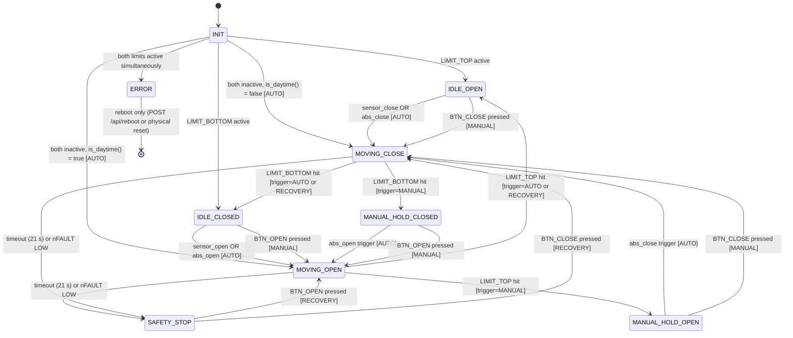

# State Machine & Control Logic — Smart Coop V2

## State Diagram



---

## States Reference

| State | Meaning | LED |
|-------|---------|-----|
| `INIT` | Startup — reading limit switches, deciding initial direction | — |
| `IDLE_OPEN` | Door fully open, auto logic active | 🟢 Green solid |
| `IDLE_CLOSED` | Door fully closed, auto logic active | 🔴 Red solid |
| `MOVING_OPEN` | Door travelling upward | 🟢 Green 1 Hz blink |
| `MOVING_CLOSE` | Door travelling downward | 🟢 Green 1 Hz blink |
| `MANUAL_HOLD_OPEN` | Opened manually — auto sensor/time blocked until backstop | 🟢 Green solid |
| `MANUAL_HOLD_CLOSED` | Closed manually — auto sensor/time blocked until backstop | 🔴 Red solid |
| `SAFETY_STOP` | Motor stopped by timeout or nFAULT — manual recovery required | 🔴 Red 1 Hz blink |
| `ERROR` | I2C failure / both limit switches active — reboot required | 🔴 Red 4 Hz blink |

> `ERROR` is distinguishable from `SAFETY_STOP` by blink speed (4 Hz vs 1 Hz).  
> `LED_RED` (GPIO6) is wired directly — works even when I2C / PCF8574 is dead.

### Battery Low Overlay

When RTC battery voltage < 2.7 V, `LED_YELLOW` blinks 1 Hz **regardless of gate state** — it overlays the primary LED pattern.

---

## Movement Trigger

`MovementTrigger` is set at the start of each movement and determines the destination state when the limit switch is reached:

| Trigger | Set by | After limit hit |
|---------|--------|----------------|
| `AUTO` | Automatic decision (sensor / time / abs override) | → `IDLE_OPEN` or `IDLE_CLOSED` |
| `MANUAL` | Button press or web UI in normal state | → `MANUAL_HOLD_OPEN` or `MANUAL_HOLD_CLOSED` |
| `RECOVERY` | Button press from `SAFETY_STOP` | → `IDLE_OPEN` or `IDLE_CLOSED` (auto logic resumes) |

---

## Complete Transition Table

| From state | Condition | To state | Trigger |
|-----------|-----------|----------|---------|
| `INIT` | `LIMIT_TOP` active, `LIMIT_BOTTOM` inactive | `IDLE_OPEN` | — |
| `INIT` | `LIMIT_BOTTOM` active, `LIMIT_TOP` inactive | `IDLE_CLOSED` | — |
| `INIT` | Both inactive, `is_daytime()=True` | `MOVING_OPEN` | AUTO |
| `INIT` | Both inactive, `is_daytime()=False` | `MOVING_CLOSE` | AUTO |
| `INIT` | Both limits active | `ERROR` | — |
| `IDLE_CLOSED` | `sensor_open` | `MOVING_OPEN` | AUTO |
| `IDLE_CLOSED` | `abs_open` | `MOVING_OPEN` | AUTO |
| `IDLE_CLOSED` | BTN_OPEN / web manual | `MOVING_OPEN` | MANUAL |
| `IDLE_OPEN` | `sensor_close` | `MOVING_CLOSE` | AUTO |
| `IDLE_OPEN` | `abs_close` | `MOVING_CLOSE` | AUTO |
| `IDLE_OPEN` | BTN_CLOSE / web manual | `MOVING_CLOSE` | MANUAL |
| `MOVING_OPEN` | `LIMIT_TOP` hit, trigger=AUTO or RECOVERY | `IDLE_OPEN` | — |
| `MOVING_OPEN` | `LIMIT_TOP` hit, trigger=MANUAL | `MANUAL_HOLD_OPEN` | — |
| `MOVING_OPEN` | Timeout > 21 s | `SAFETY_STOP` | — |
| `MOVING_OPEN` | `nFAULT` LOW | `SAFETY_STOP` | — |
| `MOVING_CLOSE` | `LIMIT_BOTTOM` hit, trigger=AUTO or RECOVERY | `IDLE_CLOSED` | — |
| `MOVING_CLOSE` | `LIMIT_BOTTOM` hit, trigger=MANUAL | `MANUAL_HOLD_CLOSED` | — |
| `MOVING_CLOSE` | Timeout > 21 s | `SAFETY_STOP` | — |
| `MOVING_CLOSE` | `nFAULT` LOW | `SAFETY_STOP` | — |
| `MANUAL_HOLD_OPEN` | `abs_close` trigger | `MOVING_CLOSE` | AUTO |
| `MANUAL_HOLD_OPEN` | BTN_CLOSE / web manual | `MOVING_CLOSE` | MANUAL |
| `MANUAL_HOLD_OPEN` | BTN_OPEN | no-op (already open) | — |
| `MANUAL_HOLD_CLOSED` | `abs_open` trigger | `MOVING_OPEN` | AUTO |
| `MANUAL_HOLD_CLOSED` | BTN_OPEN / web manual | `MOVING_OPEN` | MANUAL |
| `MANUAL_HOLD_CLOSED` | BTN_CLOSE | no-op (already closed) | — |
| `SAFETY_STOP` | BTN_OPEN | `MOVING_OPEN` | RECOVERY |
| `SAFETY_STOP` | BTN_CLOSE | `MOVING_CLOSE` | RECOVERY |
| `ERROR` | POST /api/reboot or hardware reset | restart | — |
| any state | 3× consecutive I2C `OSError` | `ERROR` | — |

---

## Decision Logic

`tick()` runs every 2 seconds. All conditions computed from:
- Current local time (`now`, minutes since midnight)
- Today's pre-computed schedule: `(wo, wc, ao, ac)` — calculated at startup and midnight
- Light buffer: 5 most-recent BH1750 readings (updated every 300 ms)

### Light Buffer

The light sensor loop fills a 5-slot circular buffer. Only after the buffer is full (`lux_ready=True`) can sensor-based decisions fire. This prevents false triggers on startup.

**Unanimity rule:** all 5 samples must agree — a single outlier (cloud, shadow) is insufficient.

### Sensor Conditions

```
sensor_open  = (wo ≤ now < wc)  AND  all(lux > lux_open  for lux in buffer)
sensor_close = (now ≥ wc OR now < wo)  AND  all(lux < lux_close for lux in buffer)
```

- `lux_open` default: **8.0 lx**
- `lux_close` default: **3.0 lx**
- Hysteresis (3 lx gap) prevents oscillation near the threshold

### Backstop (Absolute Override) Conditions

```
abs_open  = (ao ≤ now < wc)      — fires when sensor failed to open within window
abs_close = (now ≥ ac OR now < wo) — fires when sensor failed to close (lamp, moon, etc.)
```

Backstop is the **outer boundary** — the sensor operates within. Semantics:
- `abs_open`: "It's been light enough for `ao−wo` minutes and the sensor still hasn't opened — open it anyway."
- `abs_close`: "It's definitely night by now — close regardless of sensor reading."

---

## Configuration Modes

### Three Independent Sections

Each section has its own `mode` field and can be configured independently:

**`window` — when is the sensor active?**

| Mode | Behaviour |
|------|-----------|
| `sun_position` | `[sunrise_CET + sunrise_offset_min, sunset_CET + sunset_offset_min]` |
| `legacy` | Fixed hours `[hour_open, hour_close]` (default: 06:00–18:00) |

**`override_open` — backstop open time (abs_open)**

| Mode | Behaviour |
|------|-----------|
| `dynamic` | `sunrise_CET + DST + after_sunrise_min` minutes |
| `fixed` | Fixed hour `fixed_hour` (local time) |

**`override_close` — backstop close time (abs_close)**

| Mode | Behaviour |
|------|-----------|
| `fixed` | Fixed hour `fixed_hour` (local time) |
| `dynamic` | `sunset_CET + DST + after_sunset_min` minutes |

### Config Invariant

```
window_open_local  ≤  abs_open_local
abs_open_local     <  abs_close_local
abs_close_local    ≥  window_close_local
```

- **Hard validation** on `POST /api/config` — returns 400 with descriptive error if violated.
- **Soft validation** at runtime (midnight + startup) — clamps and logs a warning; device continues operating.

---

## Time System

### CET Storage Rule

The DS3231 always stores **CET (UTC+1)**. The hardware clock is **never adjusted** for daylight saving time.

Why: Changing the RTC for DST would complicate daily record timestamps, astronomical calculations, and midnight detection. The single UTC+1 offset is constant; DST is a UI/logic concern only.

### DST Detection (`is_dst`)

| Condition | Rule |
|-----------|------|
| DST start | Last Sunday of March at 02:00 CET |
| DST end | Last Sunday of October at 02:00 CET |
| Summer (CEST active) | Add +60 min to CET when computing local time |

`local_minutes(y, m, d, h, minute)` returns minutes since midnight in local time. May exceed 1440 during CEST at CET 23:xx — all comparisons with `wo/wc/ao/ac` handle this correctly.

### Daily Schedule Recalculation

`_resolve_times()` computes `(wo, wc, ao, ac)` for the current day. Called:
1. At controller startup (if RTC is synced, year ≥ 2020)
2. Every midnight

Intermediate ticks use cached `_today_times` — no per-tick sun calculation.

---

## Astronomical Approximation

Location: **Tarnów, Poland (~50°N, 21°E)**.  
Accuracy: **±15 minutes** — sufficient for dawn/dusk detection.

Cosine model anchored at solstices (CET, no DST):

| Solstice | DOY | Sunrise (min) | Sunset (min) |
|----------|-----|--------------|-------------|
| Summer (21 Jun) | 172 | 206 (03:26) | 1193 (19:53) |
| Winter (21 Dec) | 355 | 453 (07:33) | 943 (15:43) |

Derived constants:
- Rise mean: 329.5 min, amplitude: 123.5 min  
- Set mean: 1068.0 min, amplitude: 125.0 min

Formula: `rise = RISE_MEAN − RISE_AMP × cos(2π × (doy − 172) / 365)`

---

## Async Architecture

All logic runs in a single-threaded `uasyncio` event loop. No `time.sleep()` anywhere:

| Task | Period | Role |
|------|--------|------|
| `light_sensor_loop` | 300 ms per sample | Fill 5-slot lux buffer via BH1750 |
| `control_loop` | 2 s | Call `tick()`, spawn `_run_move` on state transitions, check VBAT |
| `led_loop` | 500 ms (125 ms in ERROR) | Update LED outputs per current state |
| `button_monitor` × 2 | 20 ms poll | Debounce + multi-click detection |
| `_run_move` | 20 ms poll | Motor movement, limit polling, nFAULT check |
| `_ap_watchdog` | 60 s | Shut down WiFi AP after 10 min idle |

`tick()` is **synchronous** — pure Python logic, no I/O, fully testable on CPython with mock objects.

---

## Multi-Click Button Logic

| Clicks (within 500 ms) | BTN_OPEN | BTN_CLOSE |
|------------------------|----------|-----------|
| 1× | `manual_move('open')` | `manual_move('close')` |
| ≥2× | Start WiFi AP + web server | Start WiFi AP + web server |

Debounce: 50 ms. Click window: 500 ms.
